<p align="center">
  <h1 align="center">🐦 Real-Time Bird Species Detection</h1>
  <p align="center">
    <strong>Detect and classify 500 bird species in real-time video using YOLO + EfficientNet</strong>
  </p>
  <p align="center">
    <em>A Computer Vision project for the 2025-26 tenure by <a href="https://github.com/AdisheshBalaji">Adishesh</a> and <a href="https://github.com/GPushkar1611">Pushkar</a> — Epoch IITH</em>
  </p>
</p>

---

##  Overview

A two-stage deep learning pipeline for **real-time bird detection and species classification** in video:

1. **Detection** — YOLOv8-Nano localizes birds in each frame
2. **Classification** — EfficientNet-B1 classifies each detected bird into one of **500 species** (Birdsnap taxonomy)
3. **Tracking** — Custom Kalman Filter + ByteTrack maintains consistent bird IDs across frames
4. **Small-Bird Enhancement** — SAHI (Slicing Aided Hyper Inference) boosts detection of distant or small birds

```
Video Frame → YOLO Detection → Crop → EfficientNet Classification → Kalman Tracking → Annotated Output
```

---

##  Architecture

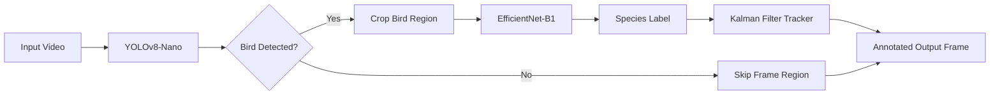

| Component | Model | Details |
|-----------|-------|---------|
| **Detection** | YOLOv8-Nano | Trained on the gpisoenka birdies dataset (~2,010 images, 224×224) |
| **Classification** | EfficientNet-B1 | 500 classes, 384×384 input, trained on Birdsnap |
| **Tracking** | Kalman Filter | 4-state (x, y, dx, dy) position-velocity tracker |
| **Small Object** | SAHI | Sliced prediction (640×640 tiles, 0.2 overlap) |

---

## Experiments & Results

### 1. Bird Detection (YOLOv8-Nano)

**Dataset:** Custom bird dataset created by merging [Birdies (Kaggle)](https://www.kaggle.com/datasets/gpiosenka/birdies) and the [Roboflow Birds Detector](https://universe.roboflow.com/jess-minaya/birds-detector-tis9s/dataset/1) datasets.
**Training:** 20 epochs, AdamW optimizer, lr=0.001, cosine LR schedule, mixed precision, mosaic + mixup augmentation 

#### Training Hyperparameters

The model was fine-tuned using the Ultralytics framework

| Hyperparameter | Value | Description |
| :--- | :--- | :--- |
| **Resolution** | 640 | Input image size (`imgsz`) |
| **Batch Size** | 16 | Training batch size |
| **Optimizer** | AdamW | High-performance optimization |
| **Initial LR** | 0.001 | Starting learning rate (`lr0`) |
| **Loss Weights** | Box: 7.5, Cls: 0.5, DFL: 1.5 | Gains for different loss components |
| **Augmentations** | Mosaic (1.0), Mixup (0.1), CopyPaste (0.1) 


| Metric | Score |
|--------|-------|
| **mAP@50** | **0.995** |
| **mAP@50-95** | **0.853** |
| **mAR@100** | **0.894** |
| **Avg Inference** | **4.83 ms** |

<details>
<summary>📈 Detection Curves (click to expand)</summary>

#### Precision-Recall Curve
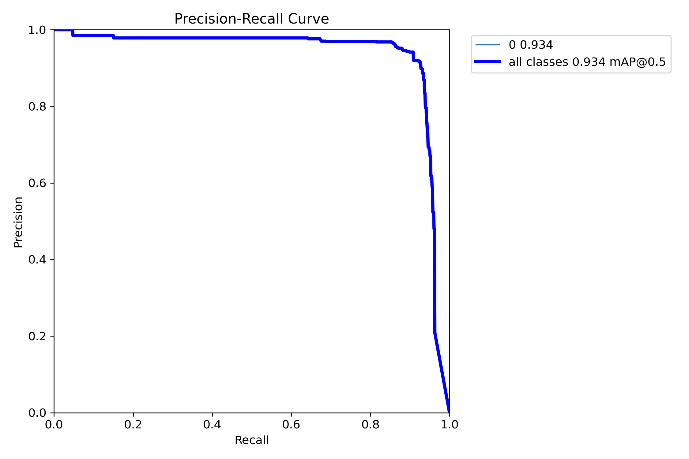

#### F1-Confidence Curve
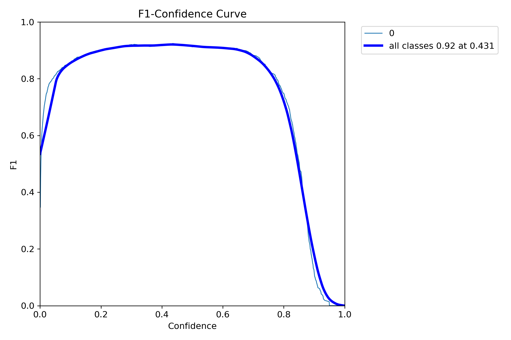

#### Precision-Confidence Curve
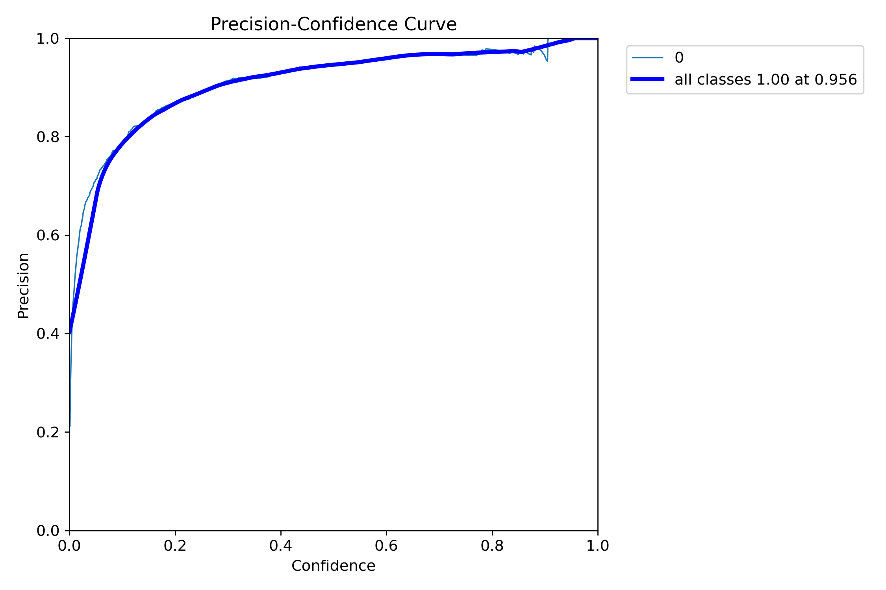

#### Recall-Confidence Curve
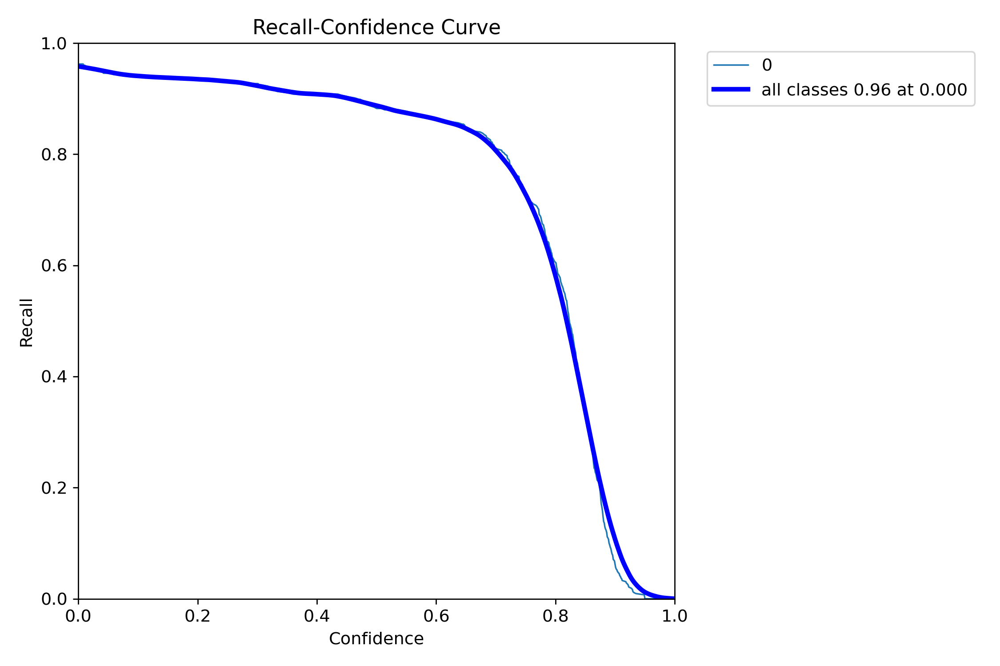

#### Confusion Matrix
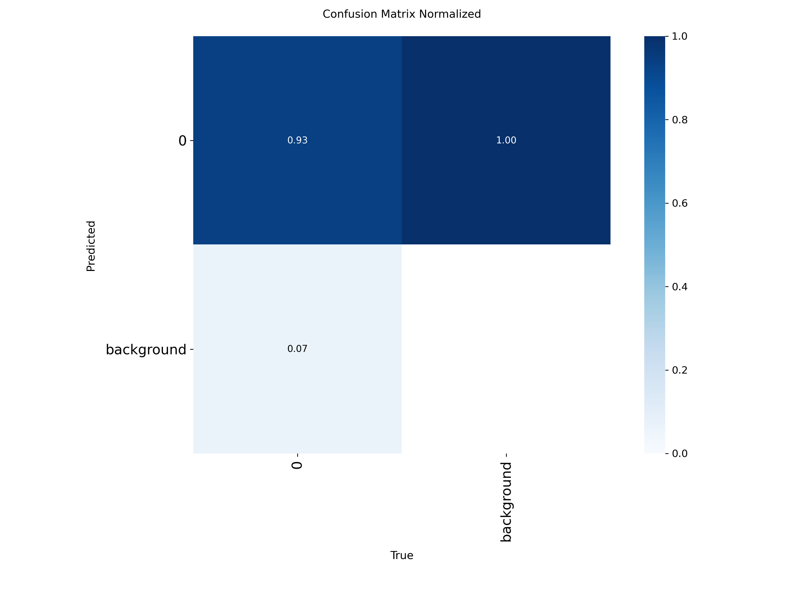

</details>

#### Sample Detection
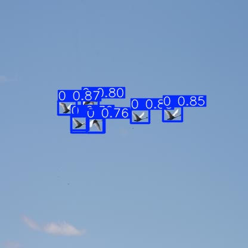

---

### 2. Species Classification (EfficientNet-B1)

**Dataset:** [Birdsnap](https://huggingface.co/datasets/sasha/birdsnap) — 500 North American bird species  
**Original Image Resolution:** 384 × 384  
**Model Input Resolution:** 240 × 240 (resized for EfficientNet-B1)  
**Backbone:** EfficientNet-B1 (ImageNet pretrained)  
**Training:** 15 epochs, AdamW optimizer with StepLR scheduling  
**Best Model:** Epoch 10  

#### Performance

| Metric | Score |
|------|------|
| **Best Validation Accuracy** | **0.705** |
| **Final Validation Loss** | **0.052** |

#### Training Hyperparameters

| Category | Parameter | Value |
|--------|----------|-------|
| **Input** | Dataset resolution | 384 × 384 |
| | Model input size | 240 × 240 |
| | Normalization | ImageNet mean & std |
| **Model** | Backbone | EfficientNet-B1 |
| | Classifier head | Linear → BN → ReLU → Dropout → Linear |
| | Hidden dimension | 512 |
| | Dropout | 0.2 |
| | Number of classes | 500 |
| **Loss** | Criterion | CrossEntropyLoss |
| | Label smoothing | 0.1 |
| **Optimizer** | Optimizer | AdamW |
| | Backbone learning rate | 5 × 10⁻⁵ |
| | Classifier learning rate | 1 × 10⁻⁴ |
| | Weight decay | 1 × 10⁻⁴ |
| **Scheduler** | Scheduler | StepLR |
| | Step size | 5 epochs |
| | Gamma | 0.3 |
| **Training** | Epochs | 15 |
| | Best epoch | 10 |

#### Data Augmentation

| Type | Method | Parameters |
|----|-------|-----------|
| Spatial | RandomResizedCrop | scale=(0.7, 1.0), ratio=(0.75, 1.33) |
| | Horizontal Flip | p = 0.5 |
| | Rotation | ±10° |
| Photometric | ColorJitter | brightness/contrast/saturation = 0.1 |
| | Hue jitter | 0.02 |
| Occlusion | Random Erasing | p = 0.25, scale=(0.02, 0.1) |

<details>
<summary>📈 Classification Curves (click to expand)</summary>

#### Training Curves (Loss & mAP)
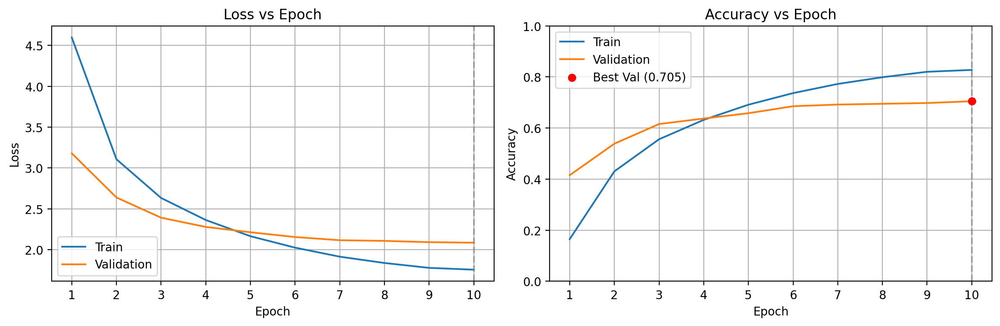

#### Top-K Accuracy
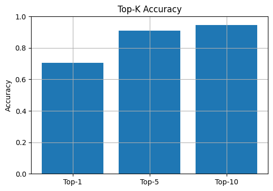

#### F1 Score Distribution
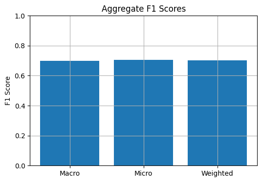

#### Confusion Matrix (Top 20 Classes)
.png)

#### Most Confused Pairs
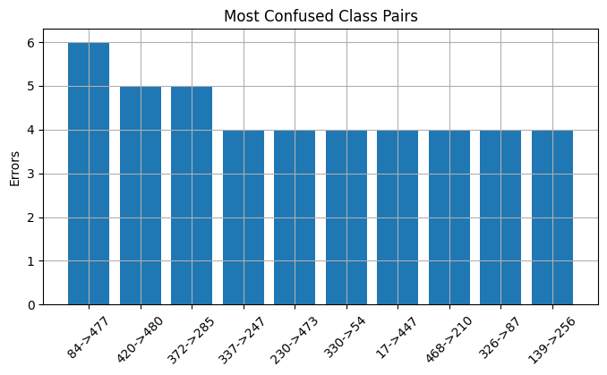

</details>

---

### 3. YOLO From Scratch (Experimental)

A from-scratch YOLO implementation from the official You Only Look Once Paper, the training and inference code is available in `notebooks/yolo-from-scratch.ipynb`.


#### Training Hyperparameters

The model was trained using a custom implementation of the YOLO loss function and a ResNet50 backbone. Below are the key hyperparameters used during the training process:

| Hyperparameter | Value | Description |
| :--- | :--- | :--- |
| **Input Resolution** | 448 x 448 | Image size used for training and inference |
| **Grid Size (S)** | 7 x 7 | Number of cells the image is divided into |
| **Batch Size** | 32 | Number of samples processed per iteration |
| **Total Epochs** | 50 | Total number of training passes through the dataset |
| **Learning Rate** | 5e-4 | Initial learning rate for the AdamW optimizer |
| **Weight Decay** | 1e-2 | L2 regularization (AdamW) |
| **Optimizer** | AdamW | Optimization algorithm for weight updates |
| **LR Scheduler** | Warmup + Cosine | `LambdaLR` warmup followed by `CosineAnnealingLR` |
| **Lambda Coord** | 10.0 | Weight for localization loss (XY and HW) |
| **Lambda NoObj** | 0.5 | Weight for confidence loss (no object) |
| **Lambda Obj** | 2.0 | Weight for confidence loss (object present) |
| **Confidence Threshold**| 0.5 | Minimum score for valid detections |
| **IoU Threshold** | 0.5 | Threshold used for mAP evaluation |

#### Training Strategy
- **Backbone:** Pre-trained **ResNet50** (initially frozen to stabilize the detection head).
- **Augmentations:** `RandomHorizontalFlip`, `ColorJitter` (0.2 brightness/contrast/saturation), and `Resize`.
- **Loss:** Custom YOLO loss based on the paper.


<details>
<summary>📈 From-Scratch Training Results (click to expand)</summary>

#### Training Metrics
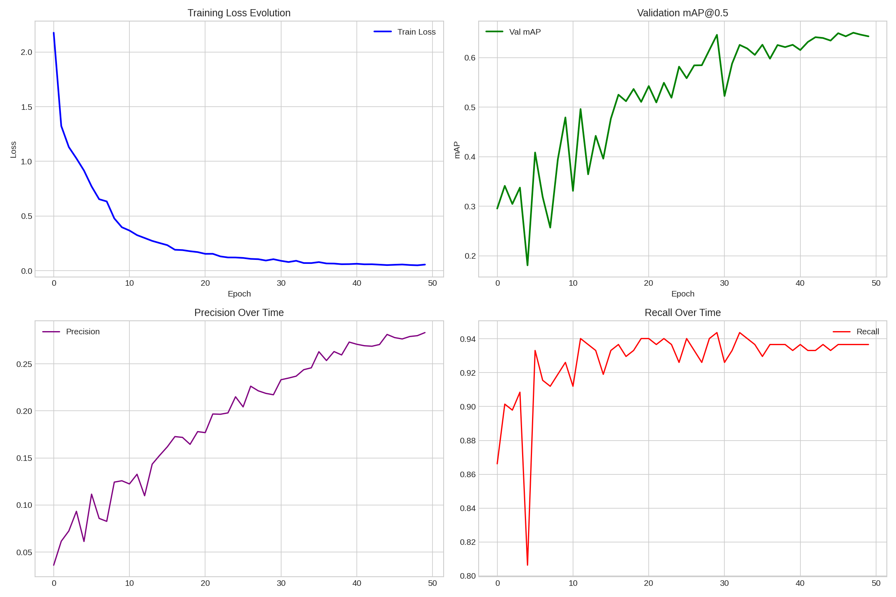

#### Precision-Recall Curve
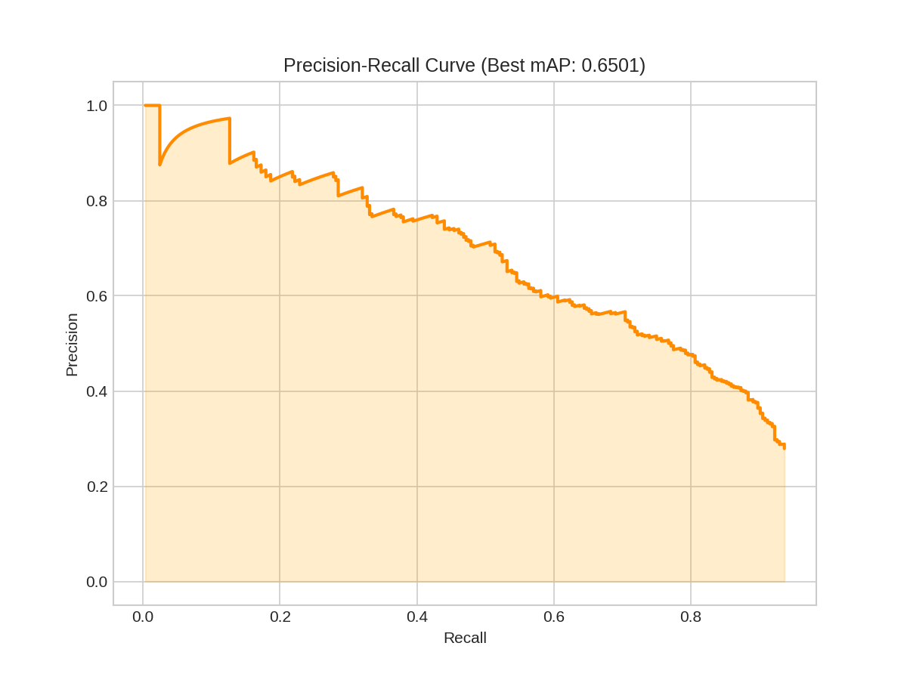

</details>

---

##  Sample Inference

### Full Pipeline Output


## Project Structure

```
Real-Time-Bird-Species-Detection/
├── src/
│   ├── app.py                        # Streamlit demo application
│   ├── utils/
│   │   ├── yolo_inference.py         # YOLO + SAHI detection with Kalman tracking
│   │   ├── combined_inference.py     # Full detection + classification pipeline
│   │   ├── kalman_filter.py          # Kalman filter implementation
│   │   ├── train_yolo.py             # YOLO training & evaluation scripts
│   │   ├── get_datasets.py           # Dataset download, split & merge
│   │   ├── compute_detection_heatmap.py
│   │   └── config.py
│   ├── metrics/                      # Evaluation results & training logs
│   ├── plots/                        # Detection metric curves
│   ├── plots_custom/                 # YOLO-from-scratch metrics
│   ├── sample_outputs/               # Per-species inference videos
│   └── runs/                         # YOLO training run checkpoints
├── notebooks/
│   ├── Bird_detection.ipynb          # YOLO detection training notebook
│   ├── sam3.ipynb                    # SAM segmentation experiments
│   └── yolo-from-scratch.ipynb       # YOLO implementation from scratch
├── modular-code/                     # Standalone modular pipeline
│   ├── dataset_preparation.py
│   ├── train.py
│   ├── model.py
│   └── run_inference.py
├── plots/                            # Species classification plots
├── Species_classification.ipynb      # EfficientNet classification training
├── bytetrack.yaml                    # ByteTrack tracker configuration
├── idx_to_class.json                 # Species ID to name mapping (500 classes)
├── Sample_inference.mp4              # Demo inference video
└── my_output.mp4                     # Additional inference output
```

---

##  Getting Started

### Prerequisites

```bash
pip install -r requirements.txt
```

### 1. Prepare Dataset

```python
from src.utils.get_datasets import *

download_birdies_dataset()
split_birdies_dataset()
combined_path = combine_datasets()
create_data_yaml(combined_path)
```

### 2. Train Detection Model

```bash
cd src/utils
python train_yolo.py
```

### 3. Train Species Classifier

Open and run `Species_classification.ipynb` to train EfficientNet-B1 on Birdsnap (500 classes).

### 4. Run Inference

```bash
# CLI inference with tracking
cd src/utils
python combined_inference.py --input path/to/video.mp4 --output output.mp4

# OR use the Streamlit app
cd src
streamlit run app.py
```

---

## Key Features

- **Real-Time Processing** — ~4.83ms detection inference per frame
- **SAHI Sliced Inference** — Tiled detection for improved small-bird accuracy
- **Kalman Filter Tracking** — Smooth, consistent track IDs across frames
- **ByteTrack Association** — Robust multi-object tracking with two-threshold matching
- **500-Species Classification** — Fine-grained recognition across North American birds
- **Streamlit Demo** — Interactive web app for uploading and processing videos

---

##  References

- [You Only Look Once (2016)](https://arxiv.org/pdf/1506.02640)
- [SAHI — Slicing Aided Hyper Inference](https://github.com/obss/sahi)
- [EfficientNet (PyTorch)](https://pytorch.org/vision/stable/models/efficientnet.html)
- [ByteTrack](https://github.com/ifzhang/ByteTrack)
- [Birdies Dataset (Kaggle)](https://www.kaggle.com/datasets/gpiosenka/birdies)
- [Birdsnap Dataset](https://huggingface.co/datasets/sasha/birdsnap)

---

##  License

This project is for educational and research purposes.
