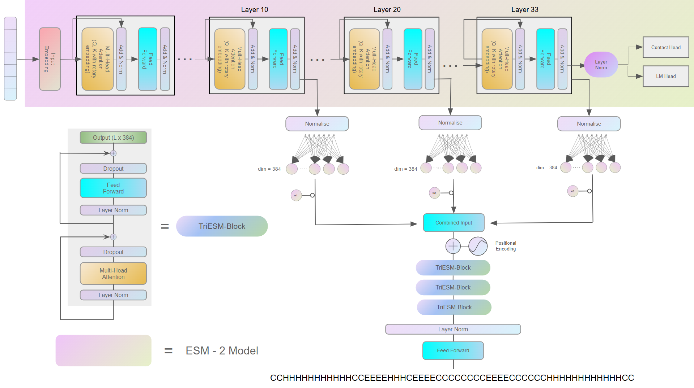
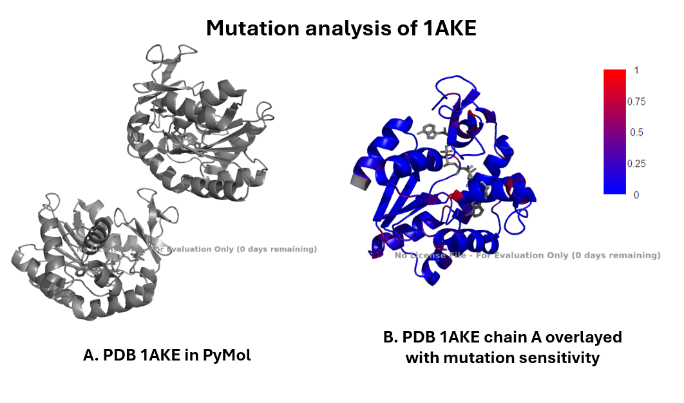
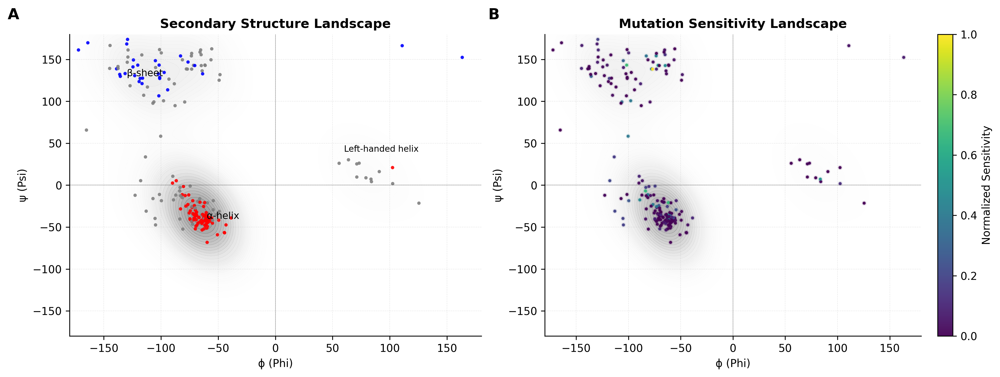
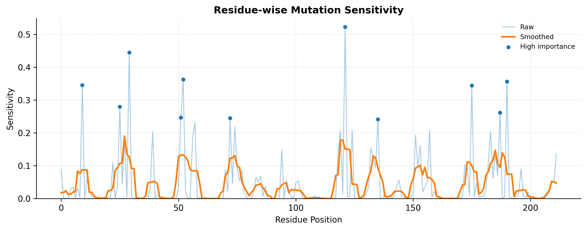

# TriESM-DSSP (T3D)

**ESM Layer Fusion Transformer for Protein Secondary Structure Prediction**

## Overview

TriESM-DSSP (T3D) is a single-sequence protein secondary structure prediction model that leverages multi-layer representations from ESM-2 and a lightweight transformer architecture.

Unlike traditional methods that rely on multiple sequence alignments (MSA) and evolutionary profiles (PSSM/HMM), T3D:

- Uses only raw protein sequences
- Exploits hierarchical representations from ESM
- Provides interpretable insights via mutation sensitivity and structural analysis

## Architecture



---

## Usage

### Training the DSSP Model

```python
python train.py \
  --train_dataset datasets/train/pssp_train_3.csv \
  --test_dataset datasets/test/test2018.csv \
  --val_dataset datasets/val/pssp_validation.csv \
  --lr 0.001 \
  --epochs 25 \
  --save_path model.pt
```

**Arguments:**

| Argument | Description |
| --- | --- |
| `--train_dataset` | Path to training dataset (`.csv`) with columns `sequence`, `dssp3` |
| `--val_dataset` | Path to validation dataset (`.csv`) with columns `sequence`, `dssp3` |
| `--test_dataset` | Path to test dataset (`.csv`) with columns `sequence`, `dssp3` |
| `--batch_size` | Batch size (optional) |
| `--num_workers` | Number of data loader workers (optional) |
| `--epochs` | Number of training epochs (optional) |
| `--lr` | Learning rate (optional) |
| `--save_path` | Path to save the trained model (optional) |

### Performing Mutation Analysis

```python
python mutation_analysis.py \
  --pdb_path 1AKE.pdb \
  --dssp_model_path models/best_model.pt \
  --results_folder_name dssp
```

**Arguments:**

| Argument | Description |
| --- | --- |
| `--pdb_path` | Path to PDB file (e.g. `1P7E.pdb`) |
| `--dssp_model_path` | Path to your trained TriESM-DSSP model |
| `--results_folder_name` | Name of the output results folder |

---

## Loss Function

### Layer Entropy Regularized Cross-Entropy

We use a combination of standard cross-entropy loss and an entropy-based regularization term to prevent layer weight collapse.

The total loss is defined as:

$$\mathcal{L} = \mathcal{L}_{CE} + \alpha \cdot \mathcal{H}(w)$$

Where:

| Symbol | Description |
| --- | --- |
| $\mathcal{L}_{CE}$ | Cross-entropy loss |
| $w = \text{softmax}(\theta)$ | Normalized layer weights |
| $\mathcal{H}(w)$ | Entropy of the layer weights |
| $\alpha$ | Regularization strength |

The entropy term is:

$$\mathcal{H}(w) = - \sum_{i} w_i \log(w_i)$$

---

## Layer-wise Analysis and Interpretability

### Layer-wise Performance

| Configuration | Q3 Accuracy |
| --- | --- |
| **Full Model** | **0.8540** |
| Layer 33 | 0.8292 |
| Layer 20 | 0.5103 |
| Layer 10 | 0.4918 |

### Representation Similarity

We compute cosine similarity between layer embeddings:

| Layer Pair | Cosine Similarity |
| --- | --- |
| L10 – L20 | 0.101 |
| L20 – L33 | 0.064 |
| L10 – L33 | 0.137 |

All pairwise similarities are **low (0.06–0.13)**, indicating that different layers encode **distinct, non-redundant representations**. Layers 10, 20, and 33 each capture complementary information across the transformer depth.

### Why Not Use Only the Final Layer (L33)?

Although the final layer achieves strong performance, the full multi-layer model provides a consistent and meaningful improvement:

```
L33 Accuracy:   0.829
Full Model:     0.854
Gain:          +2.5%
```

This gain is especially significant for structured prediction tasks.

### Direct Evidence of Complementarity

Comparing predictions from the L33-only model vs. the full multi-layer model (L10 + L20 + L33):

```
Positions improved by adding L10/L20: 25
```

**Breakdown by structure class:**

| Structure | Corrected Residues |
| --- | --- |
| Helix | 21 |
| Sheet | 1 |
| Coil | 3 |

The final layer makes specific errors that earlier layers correct, with improvements concentrated in **helix regions**. This confirms that important structural information remains distributed across layers, not just the final one.

---

## Ablation Study

We measure the performance drop when each layer is individually removed.

### Helix

| Layer Removed | Performance Drop |
| --- | --- |
| L10 | 0.0208 |
| L20 | 0.0159 |
| **L33** | **0.3023** |

Helix prediction is primarily driven by deeper representations, with earlier layers providing refinement.

### Sheet

| Layer Removed | Performance Drop |
| --- | --- |
| L10 | 0.0203 |
| L20 | 0.0333 |
| **L33** | **0.4434** |

Beta-sheet prediction strongly depends on deep layers, reflecting the importance of long-range contextual information.

### Coil

| Layer Removed | Performance Drop |
| --- | --- |
| L10 | −0.0110 |
| L20 | −0.0098 |
| L33 | −0.0222 |

Coil prediction shows no strong dependence on any single layer. Slight improvements upon removal suggest that reduced model complexity may help, indicating coil is a **less structurally constrained class**.

### Key Findings

**1. Complementary Representations**
Low inter-layer similarity confirms that each layer contributes unique information.

**2. Dominance of Deep Layers**
Layer 33 alone achieves strong performance (0.829), but the full model (0.854) is consistently better. Deep layers are powerful but not sufficient.

**3. Hierarchical Contribution**

| Layer | Role |
| --- | --- |
| L33 (deep) | Critical for structured elements (helix, sheet) |
| L20 (intermediate) | Weak but supportive |
| L10 (early) | Minimal but complementary |

While the final transformer layer provides strong overall performance, incorporating intermediate and early layers improves accuracy and corrects specific misclassifications — particularly in helix regions (21 corrected residues). Protein structural information is **hierarchically distributed** across layers, with deeper layers capturing global context and earlier layers refining local predictions.

---

## Benchmarking

We evaluate the model on multiple standard secondary structure prediction benchmarks using **Q3 accuracy** (3-class: Helix, Sheet, Coil).

| Dataset | Q3 Accuracy |
| --- | --- |
| test2018 | 0.8370 |
| **ts115** | **0.8595** |
| **cb513** | **0.8560** |
| new364 | 0.8340 |
| casp12 | 0.7955 |
| spot_2016_hq | 0.7835 |
| spot_2018_hq | 0.7787 |
| spot_2018 | 0.7708 |

---

## Mutation Analysis and Structural Sensitivity



We perform mutation sensitivity analysis on protein **1AKE (Chain A)** to understand how structural geometry influences model predictions, connecting:

```
Sequence → Structure (SSE) → Geometry (φ/ψ) → Mutation Sensitivity
```

### Ramachandran Distribution



The protein follows canonical Ramachandran distributions:

- **Helix (α):** Tight cluster (~−60°, −40°)
- **Sheet (β):** Broader distribution (~−120°, 120°)
- **Coil:** Scattered across allowed regions

Helices occupy conformationally constrained regions; sheets show greater spread.

### Sensitivity in Ramachandran Space

When mutation sensitivity is mapped onto Ramachandran space, most residues show **low sensitivity**, while high sensitivity appears in:

- β-sheet regions
- Boundary/transition regions
- Edges of helix clusters

Mutation sensitivity is **not uniform** — it is strongly dependent on backbone geometry.

### Residue-level Sensitivity Profile



Sensitivity is not random — it forms **localized peaks**, with high-sensitivity regions around:

- Residues ~20–30
- Residues ~50–60
- Residues ~115–125
- Residues ~170–190

These peaks indicate **structural or functional hotspots**.

### Sensitivity Across Secondary Structure Classes

| Structure | Mean Sensitivity |
| --- | --- |
| Helix | 0.0359 |
| Sheet | 0.0417 |
| **Coil** | **0.0569** |

**Coil (Highest Sensitivity)**
Flexible, unconstrained, and often located near structural transitions — coil regions are highly sensitive to perturbation.

**Sheet (Intermediate Sensitivity)**
Stabilized by long-range interactions; sensitive to mutations that disrupt global contacts.

**Helix (Lowest Sensitivity)**
Stabilized by local hydrogen bonds (i→i+4); structurally robust and least sensitive.

### Distribution Analysis

- **Coil:** Highest variability and extreme sensitivity values
- **Sheet:** Moderate spread with some high-impact residues
- **Helix:** Tight distribution with low variance

Even stable structures contain **high-sensitivity outliers**, indicating residues of functional importance.

### Key Findings

1. **Geometry Governs Sensitivity** — Mutation effects are structured by backbone conformation, not random.
2. **Flexibility Drives Sensitivity** — Coil regions exhibit the highest sensitivity due to structural variability.
3. **Structural Stability Reduces Sensitivity** — Helices are most stable, showing consistently low sensitivity.
4. **Localized Critical Residues** — Sensitivity peaks in specific regions indicate structural or functional hotspots.

---

## Conclusion

TriESM-DSSP demonstrates that mutation sensitivity inferred from the model aligns with structural constraints in Ramachandran space, revealing a strong relationship between conformational geometry, structural stability, and sensitivity to perturbations. This highlights that protein representations learned by the model encode **biologically meaningful structure-function relationships**.

T3D achieves competitive performance close to state-of-the-art methods, with a small gap (~2–3%) primarily due to the absence of explicit MSA-based evolutionary information. However, it offers significant advantages: relying only on single-sequence inputs enables **faster, more scalable predictions** while providing **deeper interpretability** through layer-wise analysis and mutation sensitivity insights.
