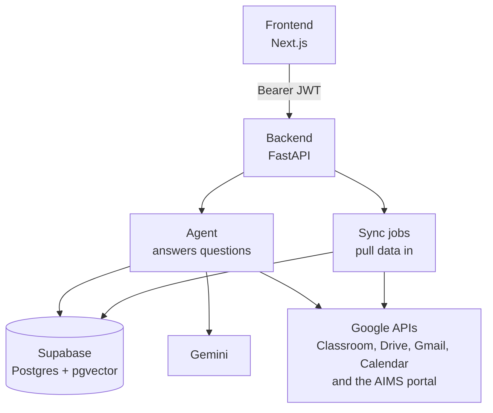
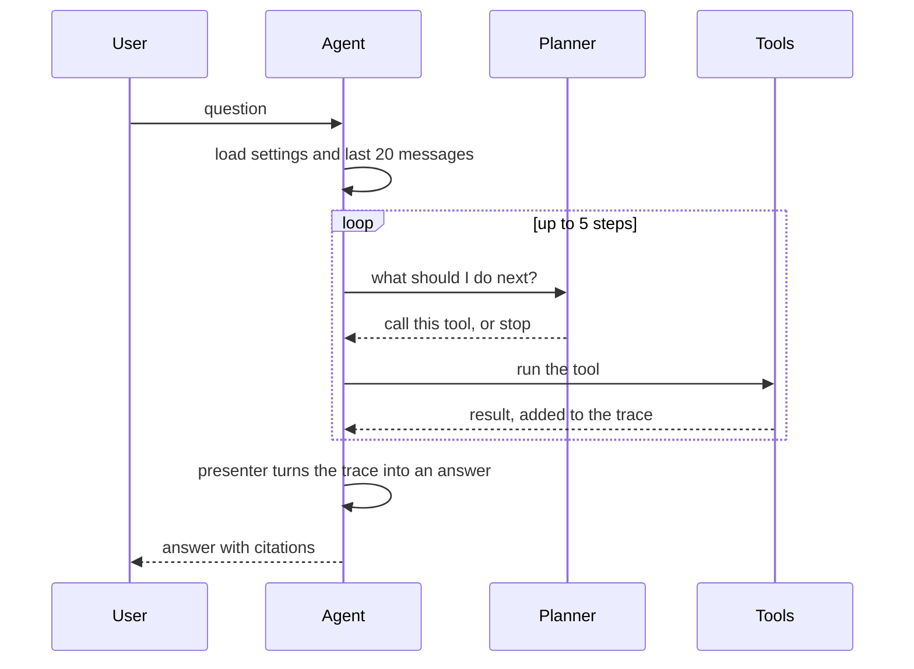
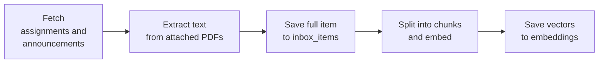
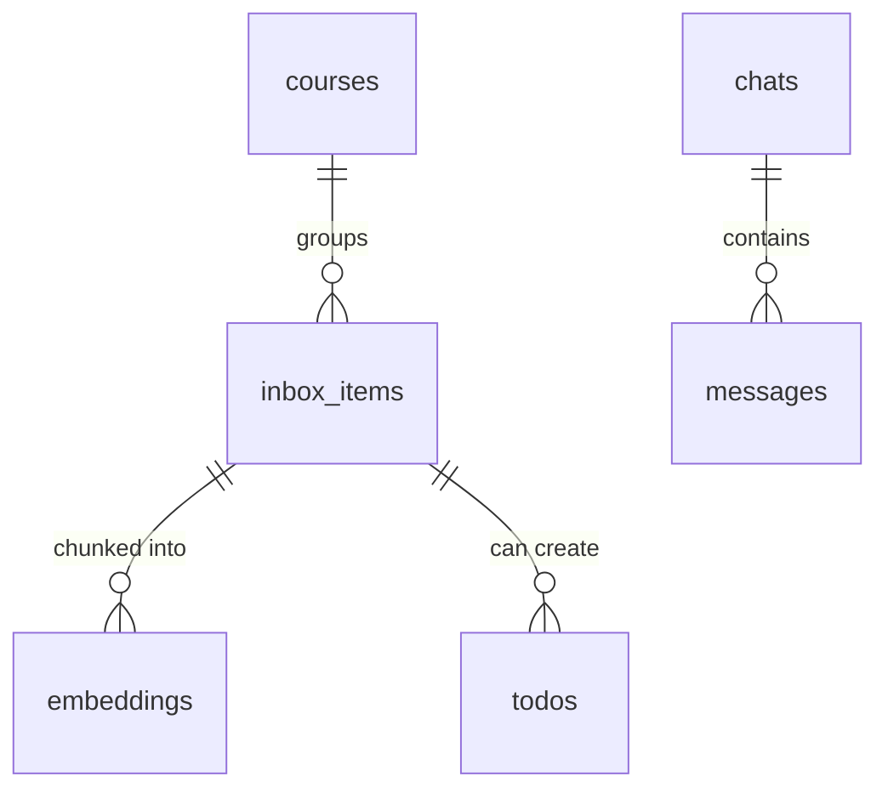

# Student Helper

An AI academic assistant that unifies a student's Google Classroom, Gmail, Google Calendar,
and AIMS (IIT Hyderabad's academic portal) into a single searchable knowledge base, and puts
a tool-using agent in front of it.

Ask "what's due in MA2150 this week?" or "explain the fixed point theorem from my slides" and
the agent plans a sequence of tool calls, retrieves grounded context from the student's own
material, and answers with citations back to the source documents.

---

## Contents

- [Capabilities](#capabilities)
- [Architecture](#architecture)
- [How a query is answered](#how-a-query-is-answered)
- [Ingestion pipeline](#ingestion-pipeline)
- [Data model](#data-model)
- [Repository layout](#repository-layout)
- [Getting started](#getting-started)
- [Configuration](#configuration)
- [API reference](#api-reference)
- [Utility scripts](#utility-scripts)
- [Security notes](#security-notes)

---

## Capabilities

| Area | What it does |
| --- | --- |
| Retrieval-augmented chat | Semantic search over ingested course material, with links back to the original Drive file or Classroom item |
| Google Classroom sync | Incremental ingestion of assignments, announcements and attached PDFs, with live progress and cancellation |
| Gmail triage | Rule-based classification of institute mail (AIMS, NSS, Classroom, hostel and mess notices) with an LLM fallback |
| Calendar and tasks | Reads the primary and a dedicated `scholr` calendar; creates events and todos that stay mirrored between Postgres and Google Calendar |
| AIMS grades | Headless-browser fetch of the grade sheet and SGPA/CGPA history, normalised into Postgres |
| Multi-turn chat | Persistent chats and message history, scoped per user by row-level security |
| Bring-your-own keys | Each user supplies their own Gemini API key and Hugging Face token from the settings page |

---

## Architecture

The system is a Next.js frontend, a FastAPI backend, and Supabase as the single store for both
relational data and vectors (via `pgvector`). Embeddings are computed through the Hugging Face
Inference API, so no model weights are loaded in-process.



Reading the two halves separately:

| Half | What it is | Where |
| --- | --- | --- |
| Agent | A LangGraph state machine. A planner picks tool calls in a ReAct loop, a presenter turns the resulting trace into prose. Three tools: retriever, scheduler, profile. | [src/brain/](src/brain/) |
| Sync jobs | Background tasks that fetch from Google and AIMS, extract text, embed it, and write both halves to Postgres. | [src/services/](src/services/), [src/brain/services/](src/brain/services/) |

### Design decisions

- **One store, two roles.** Postgres holds the source of truth (full extracted text, metadata,
  Drive links) and the vectors. Every embedding row carries an `item_id` foreign key, so a search
  hit can always be expanded into the full document.
- **Deterministic identifiers.** Item UUIDs are derived from the Google Classroom ID (UUIDv5), so
  re-running a sync upserts rather than duplicates.
- **Two-model split.** The planner reasons over tools and produces a trace; the presenter turns
  that trace into prose. Each is configurable per user, which keeps a cheap model on the reasoning
  path and lets the answer-writing model vary independently.
- **Tools behind one interface.** Every tool implements `MCPTool` (`name`, `description`,
  `input_schema`, `execute`), so the planner's prompt is generated from the tool registry rather
  than hand-maintained.
- **Remote embeddings.** Using the Hugging Face Inference API keeps the backend deployable on
  small instances; the tradeoff is per-chunk network latency during ingestion.

---

## How a query is answered

`Agent` compiles a LangGraph `StateGraph` with four nodes: load settings, load history, run the
planner and presenter, persist the turn.



Each step in detail:

1. `POST /chat` verifies the Supabase JWT and resolves a `user_id`.
2. Settings load first, so a missing Gemini key short-circuits into a prompt to visit Settings.
3. The planner sees the system prompt, the tool schemas and the recent history, and replies with
   a single tool call or `FINISH`.
4. Every tool result is appended to a running trace; the presenter reads only that trace.
5. The user message and the answer are both written back to `messages`.

Tool surface exposed to the planner:

| Tool | Actions |
| --- | --- |
| `knowledge_retriever` | `list_courses`, `search` (vector search, optionally course-scoped), `read` (full item text) |
| `scheduler` | `get_schedule`, `schedule_event`, `create_todo`, `list_todos`, `complete_todo` |
| `profile` | Student profile and registered-course lookup |

---

## Ingestion pipeline

`ClassroomIngestor` runs as a FastAPI background task and reports progress into
`user_integrations.sync_status` and `sync_progress`, which the frontend polls. Cancellation is
cooperative: the ingestor re-reads its own status row between courses.



Details that matter when reading the code:

- Only items updated since `last_synced_at` are processed, so a resync is a delta, not a rewrite.
- Item IDs are UUIDv5 hashes of the Classroom ID, so repeated runs upsert instead of duplicating.
- Chunks are 1000 characters with 200 of overlap; embeddings are 768-dimensional
  `all-mpnet-base-v2` vectors from the Hugging Face Inference API.
- Non-PDF attachments (links, videos) keep their URL metadata but contribute no text.
- Between courses the ingestor re-reads its own `sync_status` row, which is how
  `POST /classroom/cancel-sync` stops it mid-run.

Retrieval is the same path in reverse: the query is embedded with the same model and passed to the
`match_embeddings` RPC, which joins `embeddings` to `inbox_items` and returns content, cosine
similarity, title, type and attachment metadata, filtered by `user_id` and optionally by
`course_id`.

---

## Data model

Every table below hangs off `auth.users` by a `user_id` column. Leaving that out, the shape is:



| Table | Holds |
| --- | --- |
| `courses` | One row per Classroom course, unique on `(user_id, classroom_id)` |
| `inbox_items` | Assignments, announcements and materials, with full extracted text in `files_data` |
| `embeddings` | Text chunks plus a `vector(768)`, joined back to their item by `item_id` |
| `todos` | Tasks, optionally linked to an `inbox_item` and to a Google Calendar event |
| `chats`, `messages` | Conversation history |
| `user_integrations` | OAuth tokens, sync status and progress, per provider |
| `user_settings` | Per-user API keys and model choices |
| `student_grades`, `student_gpa` | Grade sheet and SGPA/CGPA history from AIMS |

Row-level security is enabled on `chats`, `messages` and `todos`. The backend holds both an
anon-key client (used to verify the caller's JWT) and a service-role client (used for writes once
the `user_id` has been established from that token).

---

## Repository layout

```
src/
  server.py                    FastAPI app: REST API, OAuth callbacks, background sync tasks
  brain/
    agent.py                   LangGraph orchestration and turn persistence
    agents/planner.py          ReAct planner over the tool registry
    agents/presenter.py        Trace to natural-language answer
    core/mcp_tool.py           Tool interface (name, description, input_schema, execute)
    core/classifier.py         Rule-first email classification, Mistral fallback
    core/system_info.py        Shared system prompt and course map
    tools/retriever.py         Vector search and full-document read
    tools/scheduler.py         Google Calendar and todos
    tools/profile.py           Student profile lookup
    services/gmail_service.py  Gmail fetch, classify, store
    services/aims_manager.py   AIMS grade and GPA sync
    services/load_aims.py      Loader for the encrypted AIMS fetcher
  services/
    class_ingestor.py          Google Classroom to Postgres and pgvector pipeline
    classroom.py               Classroom API helpers
  db/schema.sql                Full schema, RPC, indexes and RLS policies

frontend/
  src/app/                     App Router pages: login, dashboard, chat, grades, tasks,
                               integrations, settings
  src/components/              Chat surface, sidebar, AIMS modal, UI primitives
  src/context/AuthContext.tsx  Supabase session context
  src/middleware.ts            Route protection
  src/utils/supabase/          Browser and server Supabase clients

migrate_chat.sql               Incremental migration: chats and messages
migrate_todos.sql              Incremental migration: todos and the scholr calendar column
```

---

## Getting started

### Prerequisites

- Python 3.11 or newer (developed on 3.13)
- Node.js 20 or newer
- A Supabase project with the `vector` extension available
- Google Cloud OAuth credentials with the Classroom, Drive, Gmail and Calendar scopes enabled
- A Gemini API key and a Hugging Face token (entered per user in the app, not in `.env`)

### Database

Run [src/db/schema.sql](src/db/schema.sql) in the Supabase SQL editor for a fresh project. It
creates the tables, the `match_embeddings` RPC, the indexes and the RLS policies.

> The script begins with `DROP TABLE ... CASCADE`. On an existing project use
> [migrate_chat.sql](migrate_chat.sql) and [migrate_todos.sql](migrate_todos.sql) instead, which
> are written to be idempotent.

For a realistic corpus, uncomment the HNSW index at the end of the schema:

```sql
CREATE INDEX ON public.embeddings USING hnsw (embedding vector_cosine_ops);
```

### Backend

```bash
python -m venv venv
source venv/bin/activate          # Windows: venv\Scripts\activate
pip install -r requirements.txt
playwright install chromium       # required by the AIMS fetcher

cp .env.example .env              # then fill in the values below
uvicorn src.server:app --reload --port 8000
```

Place the Google OAuth client secrets at `credentials.json` in the repository root. The ingestor
reads `client_id` and `client_secret` from it to refresh stored tokens, and accepts either a `web`
or an `installed` client block.

### Frontend

```bash
cd frontend
npm install
npm run dev
```

Create `frontend/.env.local`:

```
NEXT_PUBLIC_SUPABASE_URL=...
NEXT_PUBLIC_SUPABASE_ANON_KEY=...
NEXT_PUBLIC_BACKEND_URL=http://localhost:8000
```

### First run

1. Sign up through the login page (Supabase Auth).
2. Open **Settings** and add a Gemini API key and a Hugging Face token. Chat and ingestion both
   fail closed without these.
3. Open **Integrations**, connect Google Classroom, and start a sync. Progress streams into the
   dashboard banner.
4. Optionally connect Google Calendar (which provisions the `scholr` calendar) and connect AIMS
   to pull grades.

---

## Configuration

### Backend environment (`.env`)

| Variable | Required | Purpose |
| --- | --- | --- |
| `SUPABASE_URL` | yes | Supabase project URL |
| `SUPABASE_KEY` | yes | Anon key, used to verify caller JWTs |
| `SUPABASE_SERVICE_ROLE_KEY` | yes | Service-role key for backend writes that bypass RLS |
| `FRONTEND_URL` | yes | Comma-separated allowed CORS origins |
| `BACKEND_URL` | yes | Public backend URL used to build OAuth redirect URIs |
| `GOOGLE_CLIENT_SECRETS` | no | Path to the OAuth client secrets JSON; used by the standalone scripts. The server reads `credentials.json` directly |
| `GOOGLE_TOKEN_PATH` | no | Local token cache path for CLI flows |
| `GMAIL_QUERY` | no | Server-side Gmail filter; empty fetches everything |
| `AIMS_ENCRYPTION_KEY` | for AIMS | Fernet key that decrypts `aims_fetcher.enc` |
| `MISTRAL_API_KEY` | for triage | LLM fallback when no email rule matches |
| `CHROMADB_PATH` | no | Legacy, unused since the move to `pgvector` |

### Per-user settings (`user_settings` table)

| Field | Default |
| --- | --- |
| `gemini_api_key` | none; chat is disabled until set |
| `huggingface_token` | none; search and ingestion are disabled until set |
| `planner_model` | `gemini-2.5-flash` |
| `presenter_model` | `gemini-2.5-flash` |

---

## API reference

All routes except `/` and the OAuth endpoints require `Authorization: Bearer <supabase-jwt>`.

### Chat

| Method | Path | Description |
| --- | --- | --- |
| `POST` | `/chats` | Create a chat |
| `GET` | `/chats` | List the caller's chats |
| `GET` | `/chats/{chat_id}/messages` | Message history for a chat |
| `DELETE` | `/chats/{chat_id}` | Delete a chat and its messages |
| `POST` | `/chats/{chat_id}/upload` | Attach a file to a chat |
| `POST` | `/chat` | Run one agent turn |

### Integrations and sync

| Method | Path | Description |
| --- | --- | --- |
| `GET` | `/user/integrations` | Connection and sync status per provider |
| `GET` | `/auth/google-classroom/authorize` | Begin Classroom OAuth |
| `GET` | `/auth/google-classroom/callback` | Store Classroom tokens |
| `POST` | `/classroom/resync` | Start a background ingestion run |
| `POST` | `/classroom/cancel-sync` | Request cooperative cancellation |
| `GET` | `/auth/google-calendar/authorize` | Begin Calendar OAuth |
| `GET` | `/auth/google-calendar/callback` | Store tokens, provision the `scholr` calendar |
| `POST` | `/aims/sync` | Fetch and store grades and GPA |
| `GET` | `/aims/data` | Read stored grades and GPA |
| `POST` | `/gmail/sync` | Fetch, classify and store recent mail |
| `POST` | `/gmail/reconnect` | Re-run the Gmail authorisation flow |
| `GET` | `/gmail/important` | Emails flagged as important |

### Tasks and settings

| Method | Path | Description |
| --- | --- | --- |
| `GET` | `/todos` | List todos |
| `POST` | `/todos` | Create a todo, mirrored to the `scholr` calendar |
| `PUT` | `/todos/{todo_id}` | Update a todo |
| `DELETE` | `/todos/{todo_id}` | Delete a todo and its calendar event |
| `GET` | `/user/settings` | Read per-user settings |
| `PUT` | `/user/settings` | Update keys and model choices |

---

## Utility scripts

| Script | Purpose |
| --- | --- |
| [inspect_db.py](inspect_db.py) | Print row counts and sample rows from the Supabase tables |
| [test_search.py](test_search.py) | Run a vector search end to end against a live database |
| [verify_ingestion.py](verify_ingestion.py) | Check that ingested items have matching embeddings |
| [src/brain/services/batch_process_emails.py](src/brain/services/batch_process_emails.py) | Fetch the last 100 emails, classify them, dump the result to JSON |
| [src/brain/services/fetch_gmail.py](src/brain/services/fetch_gmail.py) | Standalone Gmail fetch, for testing the fetcher outside the API |
| [src/brain/services/fetch_courses.py](src/brain/services/fetch_courses.py) | Fetch grades directly with an AIMS session cookie |

---

## Security notes

- Secrets stay untracked. `.env`, `credentials.json`, `credentials-login.json`, `token.json`,
  `password.json`, `data.json`, `courses.json` and `hf_context.txt` are all listed in
  [.gitignore](.gitignore) and none are committed. Keep it that way when adding new credential
  files.
- The service-role key bypasses RLS entirely. It is used only after `get_current_user` has
  resolved a `user_id` from the caller's JWT, and every query built with it must be filtered on
  that `user_id`.
- CORS currently appends `*` to the allowed origins alongside `allow_credentials=True`. This is
  convenient for tunnelled development but should be removed before a real deployment.
- The AIMS fetcher ships as `aims_fetcher.enc` and is decrypted and executed at runtime using
  `AIMS_ENCRYPTION_KEY`. AIMS credentials are supplied per request and are not persisted.
- Per-user Gemini keys and Hugging Face tokens are stored in `user_settings`. Restrict that table
  to the owning user and treat it as sensitive.
